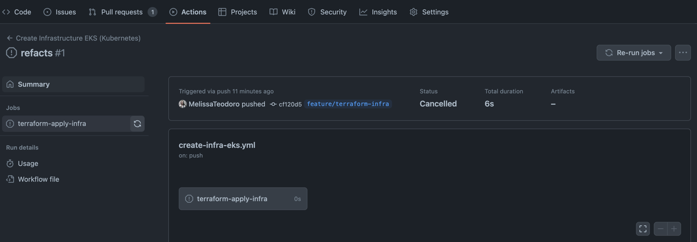

# fiap-gerenciamento-pedidos-eks

Aplicação responsável por provisionar a infraestrutura da api [fiap-gerenciamento-pedidos](https://github.com/postech-fiap/fiap-gerenciamento-pedidos) de forma automatizada
utiizando o Github Actions.

## Executando via github Actions
Na aba [Actions](https://github.com/postech-fiap/fiap-gerenciamento-pedidos-eks/actions) você poderá rodar manualmente a criação da infraestrutura.


**Importante**
Este workflow vai disparar toda parte de criação automática da Infra usando a AWS como provedora, logo, para fins de testes, não se esqueça de destruir a infra criada para evitar custos extras.

## Executando via terminal
- Necessário ter o terraform instalado
```bash
  brew tap hashicorp/tap
  brew install hashicorp/tap/terraform
```
- Necessário instalar a AWS Cli
Siga os passos da [documentação da AWS](  https://docs.aws.amazon.com/pt_br/cli/latest/userguide/getting-started-install.html):

- Necessário ter configurado a chave secreta de segurança da aws (comando: aws configure), para fins de testes usamos a região us-east-1.

1. Após clonar o repositório, vá até o diretório env/dev e execute no terminal os comandos para a criação da infra:

```bash
terraform init
terraform apply
```
2. Após finalizar, verifica se sua infra foi corretamente criada, poderá visualizar detalhes na interface da AWS.

3. Para remover toda infra criada de testes e evitar custos por parte da aws, você pode executar o seguinte comando:
```bash
terraform apply -destroy
```